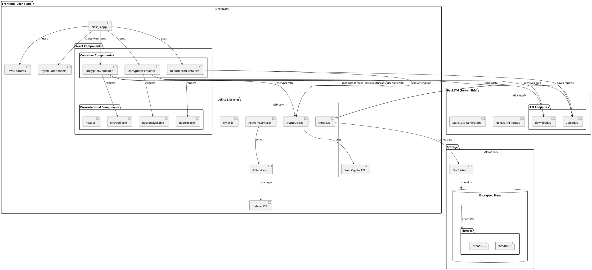
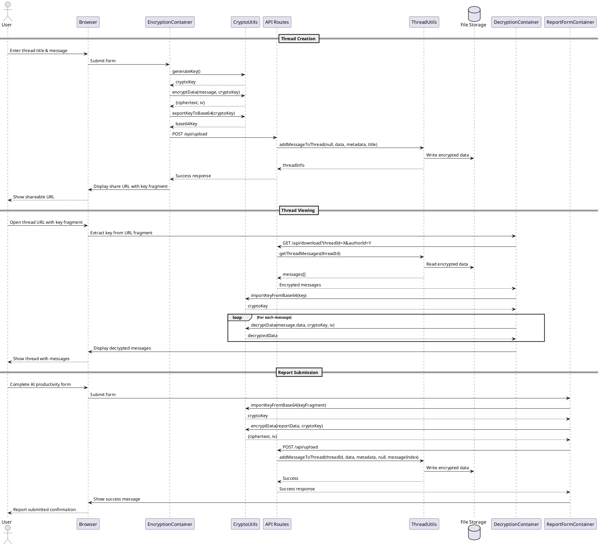
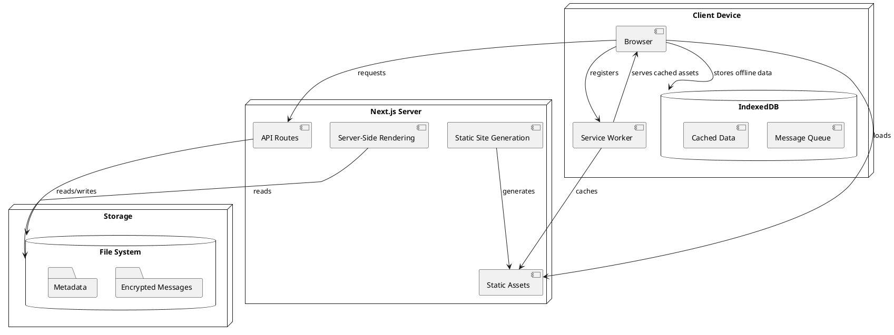

# Secure AI Productivity Tracker

A Next.js Progressive Web Application (PWA) with end-to-end encryption for secure AI productivity tracking and team collaboration.

## System Architecture in PlantUML



## Class Diagram

```plantuml
@startuml "Class Diagram"

' Core Utilities
class CryptoUtils {
  +generateKey(): Promise<CryptoKey>
  +encryptData(data, key): Promise<{ciphertext, iv}>
  +decryptData(ciphertext, key, iv): Promise<ArrayBuffer>
  +exportKeyToBase64(key): Promise<string>
  +importKeyFromBase64(base64Key): Promise<CryptoKey>
}

class ThreadUtils {
  +addMessageToThread(threadId, encryptedData, metadata, threadTitle, specificMessageIndex): Promise<object>
  +getThreadMessages(threadId): Promise<Array>
  +getLatestThreadMessage(threadId): Promise<object>
  +getThreadCreatorId(threadId): Promise<string>
  +getThreadMetadata(threadId): Promise<object>
  +getMessagesByAuthor(threadId, authorId): Promise<Array>
  -findExistingDraftReport(threadDir, authorId): object
  -slugify(text): string
  -threadExists(threadId): boolean
  -generateThreadId(title): string
  -generateAuthorId(): string
}

class DBService {
  +initDB(): Promise<boolean>
  +queueMessage(threadId, encryptedData, metadata): Promise<number>
  +getQueuedMessages(): Promise<Array>
  +updateQueuedMessageStatus(id, status, attempts): Promise<boolean>
  +removeQueuedMessage(id): Promise<boolean>
  +cacheData(key, data): Promise<boolean>
  +getCachedData(key): Promise<any>
  +clearMessageQueue(): Promise<boolean>
}

class NetworkService {
  +initNetworkMonitoring(): boolean
  +isOnline(): boolean
  +onOnline(callback): void
  +onOffline(callback): void
  +removeOnlineCallback(callback): void
  +removeOfflineCallback(callback): void
  +syncQueuedMessages(): Promise<Array>
}

class StyleUtils {
  +Breakpoint: {
    SMALL_MOBILE: 320,
    LARGE_MOBILE: 480,
    TABLET_PORTRAIT: 768,
    TABLET_LANDSCAPE: 992,
    LAPTOP: 1200,
    LARGE_DESKTOP: 1440
  }
}

' Container Components
class EncryptionContainer {
  -encryptionKey: CryptoKey
  -title: string
  -message: string
  -isEncrypting: boolean
  -error: string
  -shareUrl: string
  +handleTitleChange(title): void
  +handleMessageChange(message): void
  +handleSubmit(): Promise<void>
}

class DecryptionContainer {
  -threadMessages: Array
  -isLoading: boolean
  -error: string
  -viewMode: string
  -networkStatus: boolean
  -isMessageQueued: boolean
  +handleAddMessage(message): Promise<void>
  +handleReportClick(message): void
  +toggleAddForm(): void
}

class ReportFormContainer {
  -teamMember: string
  -teamRole: string
  -rows: Array
  -expandedRows: object
  -isSubmitting: boolean
  -isReadOnly: boolean
  -error: string
  -success: boolean
  +handleSDLCStepChange(id, value): void
  +handleRowChange(id, field, value): void
  +toggleRowExpansion(id): void
  +addRow(): void
  +removeRow(id): void
  +prepareReportData(status): Promise<object>
  +handleSaveAsDraft(e): Promise<void>
  +handleSubmit(e): Promise<void>
}

' API Endpoints
class UploadAPI {
  +handler(req, res): Promise<void>
}

class DownloadAPI {
  +handler(req, res): Promise<void>
}

' Relationships
CryptoUtils "1" -- "1..*" EncryptionContainer
CryptoUtils "1" -- "1..*" DecryptionContainer
CryptoUtils "1" -- "1..*" ReportFormContainer

ThreadUtils "1" -- "1" UploadAPI
ThreadUtils "1" -- "1" DownloadAPI

DBService "1" -- "1" NetworkService
NetworkService "1" -- "1..*" DecryptionContainer

ReportFormContainer "1" --> "1" ThreadUtils : uses for submissions
DecryptionContainer "1" --> "1" ThreadUtils : uses for viewing

EncryptionContainer ..> UploadAPI : calls
DecryptionContainer ..> DownloadAPI : calls
ReportFormContainer ..> UploadAPI : calls

@enduml
```

## Sequence Diagram for Message Flow



## Component Diagram

```plantuml
@startuml "Component Diagram"

!define RECTANGLE class

package "Pages" {
  [index.js] as HomePage
  [/channel/[id]/index.js] as ChannelPage
  [/channel/[id]/report.js] as ReportPage
  [/_offline.js] as OfflinePage
  [/api/upload.js] as UploadAPI
  [/api/download.js] as DownloadAPI
}

package "Components" {
  package "Containers" {
    [EncryptionContainer.js] as EncryptionContainer
    [DecryptionContainer.js] as DecryptionContainer
    [ReportFormContainer.js] as ReportFormContainer
    [ReportViewer.js] as ReportViewer
  }
  
  package "Presentational" {
    [EncryptForm.js] as EncryptForm
    [ReportForm.js] as ReportForm
    [Header.js] as Header
    [ResponsiveTable.js] as ResponsiveTable
    [CreatableComboBox.js] as CreatableComboBox
  }
}

package "Libraries" {
  [cryptoUtils.js] as CryptoUtils
  [thread.js] as ThreadUtils
  [storage.js] as StorageUtils
  [dbService.js] as DBService
  [networkService.js] as NetworkService
  [styles.js] as StyleUtils
}

' Pages relationships
HomePage --> EncryptionContainer
ChannelPage --> DecryptionContainer
ReportPage --> ReportFormContainer
ReportPage --> ReportViewer

' Container relationships
EncryptionContainer --> EncryptForm
EncryptionContainer --> CryptoUtils
EncryptionContainer --> UploadAPI

DecryptionContainer --> CryptoUtils
DecryptionContainer --> DownloadAPI
DecryptionContainer --> NetworkService

ReportFormContainer --> ReportForm
ReportFormContainer --> CryptoUtils
ReportFormContainer --> UploadAPI

' API relationships
UploadAPI --> ThreadUtils
DownloadAPI --> ThreadUtils
ThreadUtils --> StorageUtils

' UI Component relationships
ReportForm --> ResponsiveTable
ReportForm --> CreatableComboBox

' Service relationships
NetworkService --> DBService

@enduml
```

## Deployment Diagram



## System Features

- **End-to-End Encryption**: AES-GCM 128-bit encryption entirely in the browser
- **Secure Thread Sharing**: Encryption keys shared via URL fragments (never sent to server)
- **Responsive Design**: Mobile-first approach with dynamic breakpoint management
- **Progressive Web App**: Offline support, message queueing, and push notifications
- **AI Productivity Tracking**: Comprehensive form for measuring AI-assisted productivity gains
- **Report Management**: Draft saving, editing, and final submission capabilities
- **Thread-based Messaging**: Threaded conversations with multi-user support
- **User-specific Visibility**: Thread creators can see all messages, others see only their messages

## Technical Implementation Details

- **Server-Side**: Next.js Static Site Generation with dynamic paths
- **Client-Side**: React with functional components and hooks
- **Styling**: Styled-components for component-scoped CSS
- **Offline Support**: IndexedDB for local storage and message queueing
- **Encryption**: Web Crypto API for AES-GCM encryption/decryption
- **Storage**: File-based storage on server (can be replaced with a database in production)
- **PWA Features**: Service worker for offline caching and background sync

## Project Structure

The codebase is organized following a strict separation of concerns:

- `/pages`: Next.js pages and API routes
- `/components/containers`: Components with business logic and state
- `/components/presentational`: Pure UI components without state
- `/lib`: Utility functions and services
- `/public`: Static assets and PWA manifest
- `/styles`: Global styles and theme definitions

## Development Setup

```bash
# Install dependencies
npm install

# Run development server
npm run dev
```

## Security Considerations

- All encryption/decryption occurs client-side
- The server never has access to encryption keys or plaintext data
- HTTPS is required in production for secure key transmission in URL fragments
- Authentication should be added in production deployments
- Regular security audits recommended for production use